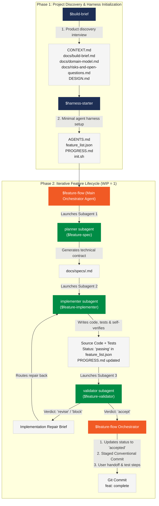

# AI Expert Workflow Overview

This document provides a comprehensive overview of the **AI Expert Workflow** (`activeWorkflow = ai-expert-workflow`) configured in the **BasketCoach** repository. It details the relationship between the 6 core workflow skills, the two-phase lifecycle, generated artifacts, status transitions, and operating rules.

---

## 1. Workflow Architecture & Lifecycle Diagram

---

## 2. Subagent Architecture & Role Separation

In **Phase 2**, the main agent runs **`$feature-flow`** as the **Main Orchestrator**. Rather than executing all tasks in a single context, the orchestrator delegates each step to an independent, specialized **subagent**:

1. **`planner` subagent** (wraps `$feature-spec`):
   * **Role:** Analyzes the repository and writes the technical specification `docs/specs/<feature-id>.md`.
   * **Boundary:** Does not write application code.
2. **`implementer` subagent** (wraps `$feature-implementer`):
   * **Role:** Reads the spec, implements code and tests, self-verifies, and sets status to `passing`.
   * **Boundary:** Does not perform final independent validation and never creates git commits or sets status to `accepted`.
3. **`validator` subagent** (wraps `$feature-validator`):
   * **Role:** Independently evaluates diff, tests, security, and quality against the spec.
   * **Boundary:** Does not write broad fixes; returns a verdict (`accept`, `revise`, or `block`). If `revise`, generates an executable repair brief for the `implementer` subagent.

---

## 3. Skills & Generated Artifacts Reference

### Phase 1: Discovery & Harness Setup

| Skill | Primary Role | Core Generated Artifacts | Optional / Secondary Artifacts |
| :--- | :--- | :--- | :--- |
| **`$build-brief`** | Guided interview to clarify product scope, target users, domain glossary, and visual design before coding. | • `CONTEXT.md` (Domain glossary) • `docs/build-brief.md` (Problem, users, goals, MVP slice) • `docs/domain-model.md` (Entities & lifecycle states) • `docs/risks-and-open-questions.md` (Risks & assumptions) | • `DESIGN.md` (Visual design & tokens, required when UI exists) • `docs/technical-discovery.md` • `docs/user-and-access-model.md` • `docs/mvp-scope.md` • `docs/design/concepts/*.png` • `docs/adr/*.md` |
| **`$harness-starter`** | Creates the minimal 4-file startup harness for coding agents to work autonomously after discovery. | • `AGENTS.md` (Repository operating rules & landing page) • `feature_list.json` (Session-sized feature list) • `PROGRESS.md` (Verified state & session log) • `init.sh` (Repository startup & verification script) | *Creates ONLY these 4 files.* Does not modify product code or create extra checklists. |

---

### Phase 2: Iterative Feature Lifecycle

| Skill | Primary Role | Core Generated / Updated Artifacts | Key Operating Rules |
| :--- | :--- | :--- | :--- |
| **`$feature-flow`** | **Main Orchestrator:** Manages the feature pipeline by coordinating Planner → Implementer → Validator subagents until a feature reaches `accept`. | • Coordinates subagents (`feature-spec`, `feature-implementer`, `feature-validator`). • Persists `accepted` status & validator evidence in `feature_list.json`. • Creates Conventional Commit (`feat: complete <feature-id>`). • Delivers final user handoff (What changed, How to test locally, Verdict, Commit, Next step). | • Subagents never commit; only the orchestrator commits upon acceptance. • Stages strictly feature-related files. • Runs in until-accepted mode by default. |
| **`$feature-spec`** | **Planner Subagent:** Converts a session-sized feature entry into an implementation-ready technical contract. | • `docs/specs/<feature-id>.md` | • Target: 100–250 lines. • Includes Given/When/Then acceptance scenarios, repo research, expected file changes, visual design impact, durable doc impact, verification plan, and validator checklist. |
| **`$feature-implementer`** | **Implementer Subagent:** Writes code, tests, and self-verifies against the spec contract. | • Application source code & tests. • Updates `feature_list.json` (`in_progress` → `passing`). • Updates `PROGRESS.md` with implementation summary & exact evidence. • Updates durable docs (`ARCHITECTURE.md`, `CONSTRAINTS.md`, `DESIGN.md`). | • Never sets status to `accepted` (only `passing`). • Self-verification is mandatory but does not replace independent validation. • Updates `init.sh` if baseline verification changes. |
| **`$feature-validator`** | **Independent QA Subagent:** Evaluates code, tests, security, and docs against the spec and quality rubrics. | • Returns verdict: `accept`, `revise`, or `block`. • Generates **Implementation Repair Brief** if verdict is `revise` or `block`. • Optionally creates `docs/validations/<feature-id>.md`. | • Applies `validation-rubric.md` and feature-scoped `security-checklist.md`. • Re-runs verification checks (`init.sh`, unit tests, E2E checks). • Evaluates durable doc accuracy and code boundaries. |

---

## 4. Feature State Machine & Conventions

| Status | Meaning | Set By |
| :--- | :--- | :--- |
| `not_started` | Feature is defined in `feature_list.json` and dependency-ready, but work has not begun. | `$harness-starter` |
| `in_progress` | Feature is actively being planned or implemented in the current session. | `$feature-implementer` |
| `passing` | Implementation and self-verification are complete with recorded evidence. Ready for independent validation. | `$feature-implementer` |
| `accepted` | Independent validator returned `accept` and the orchestrator persisted acceptance and created a commit. | `$feature-flow` (Orchestrator) |
| `blocked` | Implementation or validation cannot proceed due to blocking ambiguity, dependency, or security flaw. | `$feature-implementer` / `$feature-validator` |

---

## 5. Core Control Artifacts Summary

1. **`feature_list.json`**: Machine-readable feature tracking file. Each entry contains `id`, `area`, `title`, `user_visible_behavior`, `depends_on`, `status`, `verification`, `evidence`, and `notes`.
2. **`PROGRESS.md`**: Living document recording the verified baseline state, execution log, session history, and unresolved risks/blockers.
3. **`init.sh`**: Standard non-blocking verification gate for the repository. Must execute fast, automated checks (e.g., `./gradlew testDebugUnitTest --quiet`) and exit 0 on success or non-zero on failure. Must not start blocking dev servers.
4. **`AGENTS.md`**: Landing page and routing rules for agents working on the project.
5. **Durable Docs (`ARCHITECTURE.md`, `CONSTRAINTS.md`, `DESIGN.md`)**: Updated alongside code whenever durable knowledge (boundaries, operational MUST/MUST NOT rules, or UI tokens) is established or changed.
