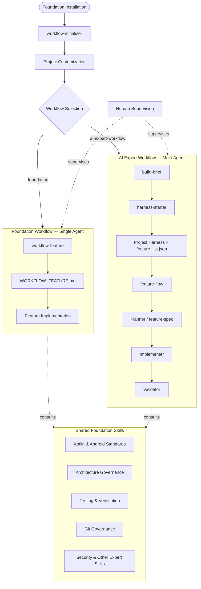

# Architecture Overview

The **Android AI Workflow Foundation v3.0.0** is a modular framework designed to support different AI-assisted development methodologies on top of a shared engineering foundation.

The Foundation separates three concerns:

1. Project initialization and configuration
2. Feature development methodology
3. Shared engineering guardrails and technical expertise

This allows a project to choose how AI agents collaborate without changing the underlying engineering standards.

## High-Level Architecture



---

# The Modular Layers

## 1. Foundation Core & Initialization

Everything starts with the Foundation Core.

`workflow-initializer` is responsible for bootstrapping and customizing the project. It prepares the project-specific configuration, performs stack diagnosis, manages optional plugins, and lets the project select its development workflow.

Typical responsibilities include:

* **Stack Diagnosis:** Understanding the project's architecture, technologies, and existing conventions.
* **Project Customization:** Generating or updating project-specific instructions and configuration.
* **Workflow Selection:** Choosing the development methodology used by the project.
* **Plugin Management:** Activating optional skills from the Foundation catalog.

`workflow-initializer` is common to both workflows. It prepares the environment before feature development begins.

---

# 2. Pluggable Development Methodology

This layer defines **how feature work is organized and delegated**.

The Foundation currently provides two methodologies.

## A. Foundation Workflow

### Single-agent, centralized workflow

`workflow-feature` acts as the Foundation's native Workflow Architect.

The same AI agent can:

1. Analyze the feature and repository.
2. Define the technical approach.
3. Generate the implementation workflow.
4. Guide the implementation.
5. Apply the project's engineering and verification rules.

The result is a persistent `WORKFLOW_FEATURE.md` roadmap that provides the implementation structure.

**Main characteristic:** one agent maintains the feature context and owns the workflow end to end.

This approach minimizes coordination and handoff overhead and works well when a single agent can effectively handle the complete feature lifecycle.

---

## B. AI Expert Workflow

### Project-centric, spec-driven, multi-agent workflow

The AI Expert Workflow adds an explicit project setup and feature lifecycle on top of the shared Foundation.

Its initial stages establish the project context:

1. **build-brief** — clarifies the product, domain, users, workflows, constraints, MVP scope, and risks.
2. **harness-starter** — turns the confirmed discovery into the minimal project harness and an initial feature backlog.
3. **feature-flow** — orchestrates the lifecycle of individual features.

For each feature, specialized agents handle separate responsibilities:

1. **feature-spec** — produces an implementation-ready specification.
2. **feature-implementer** — implements the approved specification.
3. **feature-validator** — independently validates the result against the specification and project rules.

**Main characteristic:** project setup, feature planning, implementation, and validation are explicitly separated between specialized roles.

The workflow is **iterative and feature-driven**. It does not require every feature to be fully specified before implementation starts. Features can be specified and developed one at a time as the project evolves.

This introduces additional coordination and handoff overhead, but provides stronger separation of responsibilities, persistent project state, explicit specifications, and independent validation.

---

# 3. Shared Expert Guardrails

Both workflows operate on top of the same Foundation Core.

These shared skills define the technical standards and constraints that apply independently of the selected workflow.

Examples include:

* Kotlin and Android coding standards.
* Architecture governance.
* Dependency management.
* Testing and verification.
* Git governance.
* Security and privacy rules.
* Project-specific expert skills.

The guardrails are **not a separate final validation stage**. They are shared constraints and technical knowledge consulted throughout the workflow.

This means:

```text
Foundation Workflow
        │
        └── Shared Foundation Guardrails

AI Expert Workflow
        │
        └── Shared Foundation Guardrails
```

The selected workflow determines **how the work is organized**; the shared Foundation determines **the engineering standards under which the work must be performed**.

---

# Single-Agent vs. Multi-Agent

The key distinction between the two methodologies is the allocation of responsibility.

## Foundation Workflow

```text
Human
  │
  ▼
Single AI Agent
  ├── Analyze
  ├── Plan
  ├── Implement
  └── Verify
  │
  ▼
Human Review
```

## AI Expert Workflow

```text
Human
  │
  ▼
Workflow Orchestrator
  ├── Planner
  ├── Implementer
  └── Validator
  │
  ▼
Human Review
```

In both models, the human remains the highest-level supervisor and decision maker.

The AI Expert Workflow adds another layer of automated orchestration between the human and the individual agents.

---

# Choosing a Workflow

The choice should not be based strictly on whether the project is new or existing.

Both methodologies can be used in either situation.

A practical distinction is:

### Use the Foundation Workflow when

* One agent can effectively own the feature from analysis to implementation.
* The project architecture and constraints are already reasonably understood.
* A continuous workflow is more valuable than multiple handoffs.
* Minimizing coordination overhead is important.

### Use the AI Expert Workflow when

* The project benefits from explicit project discovery and persistent feature tracking.
* The work benefits from separating planning, implementation, and validation.
* Independent validation is valuable.
* Explicit specifications and handoffs are useful.
* Several specialized agents can provide meaningful value over a single continuous agent.
* The AI development process itself is part of the objective.

The distinction is therefore not:

> **New project vs. existing project**

but:

> **Single-agent execution vs. multi-agent specialization and structured project lifecycle.**

---

# Routing & Safety

The active workflow is stored in:

```text
.agents/workflow.json
```

For example:

```json
{
  "activeWorkflow": "foundation"
}
```

or:

```json
{
  "activeWorkflow": "ai-expert-workflow"
}
```

This configuration acts as a routing and safety boundary.

```text
activeWorkflow = foundation
        │
        └── workflow-feature ✅

activeWorkflow = ai-expert-workflow
        │
        └── feature-flow ✅
```

The inactive workflow remains available where installed, but must not orchestrate feature work.

This prevents mixing two different feature-development methodologies within the same active workflow.

---

# Architectural Principle

The Foundation is therefore not a single development workflow.

It is a shared engineering foundation that allows different AI-assisted development methodologies to operate under the same technical standards.

```text
             ANDROID AI WORKFLOW FOUNDATION
                           │
              ┌────────────┴────────────┐
              │                         │
      Foundation Workflow       AI Expert Workflow
        Single Agent             Multi-Agent
      Feature-centric          Project-centric
              │                         │
              └────────────┬────────────┘
                           │
                 Shared Foundation Core
            Governance · Android · Testing
              Git · Architecture · Security
                           │
                           ▼
                    Human Supervision
```

> **Same Foundation, different development methodology.**
