# Foundation vs. AI Expert Workflows

The Android AI Workflow Foundation separates **shared engineering governance** from the **method used to organize AI-assisted development**.

A project can use the Foundation's native workflow or an alternative workflow plugin while keeping the same underlying engineering standards, technical expertise, and human supervision.

The main difference is not whether the project is new or existing, nor whether the feature is small or large.

The key questions are:

> **What is the main unit of work?**

and:

> **Do we want one AI agent to own the work end to end, or do we want to distribute responsibilities across specialized agents?**

---

# 1. The Shared Foundation

Regardless of the selected workflow, the project uses the same Foundation layer for common engineering concerns:

* Architecture and coding rules.
* Android and Kotlin practices.
* Dependency management.
* Testing and verification.
* Git governance.
* Security and technical guardrails.
* Project-specific instructions and context.

The selected workflow determines **how the work is organized and delegated**.

The Foundation determines **the engineering standards under which the work is performed**.

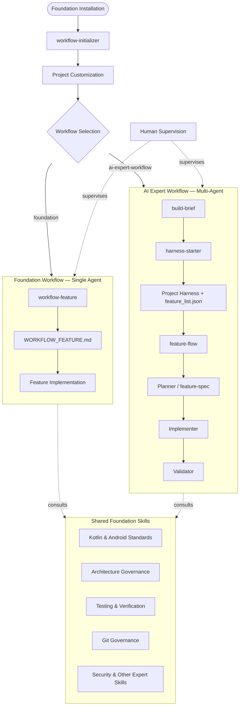

---

# 2. The Fundamental Difference

The two workflows share the same engineering foundation, but they organize work differently.

## Foundation Workflow

**Feature-centric and single-agent.**

The main unit of work is the **feature**.

One AI agent maintains the context of the feature and can own the workflow from analysis through implementation and verification.

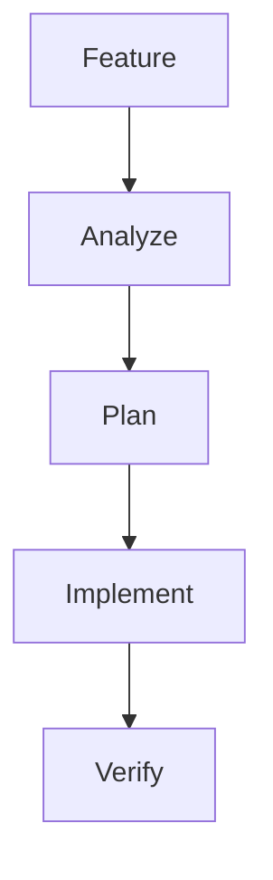

The emphasis is on:

* continuity of context,
* centralized responsibility,
* architectural consistency,
* and low coordination overhead.

## AI Expert Workflow

**Project-centric, spec-driven, and multi-agent.**

The workflow first establishes a project-level development context and a structured feature backlog.

Individual features then move through a specialized lifecycle:

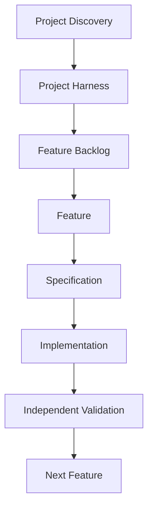

The emphasis is on:

* persistent project context,
* explicit specifications,
* specialized agent roles,
* explicit handoffs,
* tracked feature state,
* and independent validation.

---

# 3. Feature-Centric vs. Project-Centric

This is one of the most important differences.

## Foundation Workflow

The workflow starts from a feature:

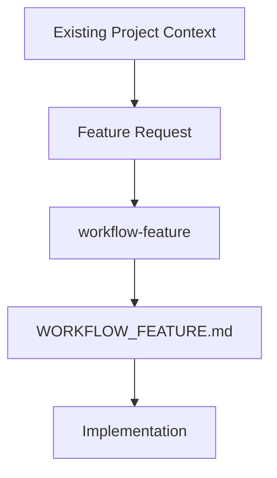

The workflow is primarily concerned with making the **current feature** technically coherent within the repository.

It does not require the project to have a formal backlog or a complete model of all future work.

## AI Expert Workflow

The workflow introduces explicit project-level structure:

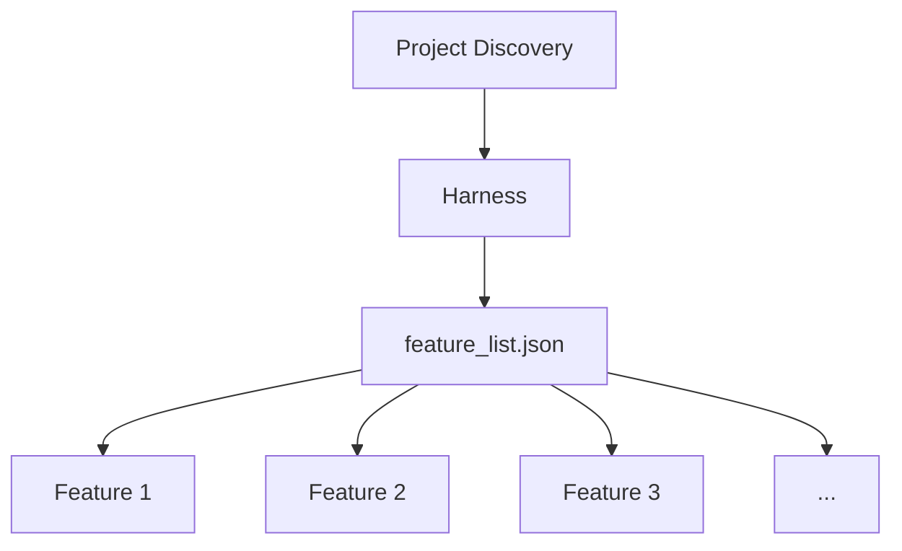

This allows the development process to track:

* feature state,
* dependencies,
* implementation specifications,
* progress,
* validation evidence,
* and acceptance.

The project therefore becomes an explicit part of the workflow rather than merely the context in which the current feature is implemented.

---

# 4. How Tasks Are Managed

## Foundation Workflow

The current feature is decomposed into a technical implementation workflow.

The main artifact is:

```text
WORKFLOW_FEATURE.md
```

It contains:

* architectural analysis,
* implementation decisions,
* technical steps,
* testing requirements,
* validation tasks,
* and governance checkpoints.

The workflow is persistent, but it is primarily a roadmap for **one feature**.

### Model

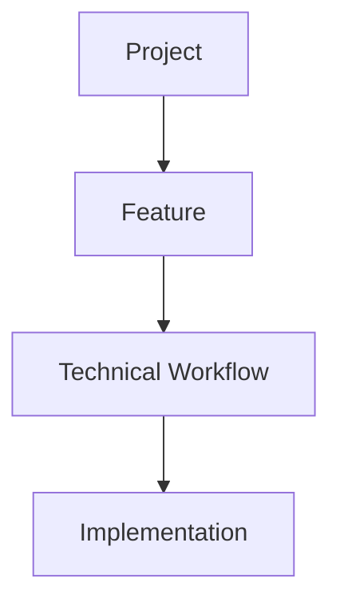

## AI Expert Workflow

The project has an explicit work queue represented by:

```text
feature_list.json
```

Each feature can carry:

* a description,
* dependencies,
* acceptance criteria,
* implementation state,
* and verification expectations.

A feature is then handled independently by the workflow.

Conceptually:

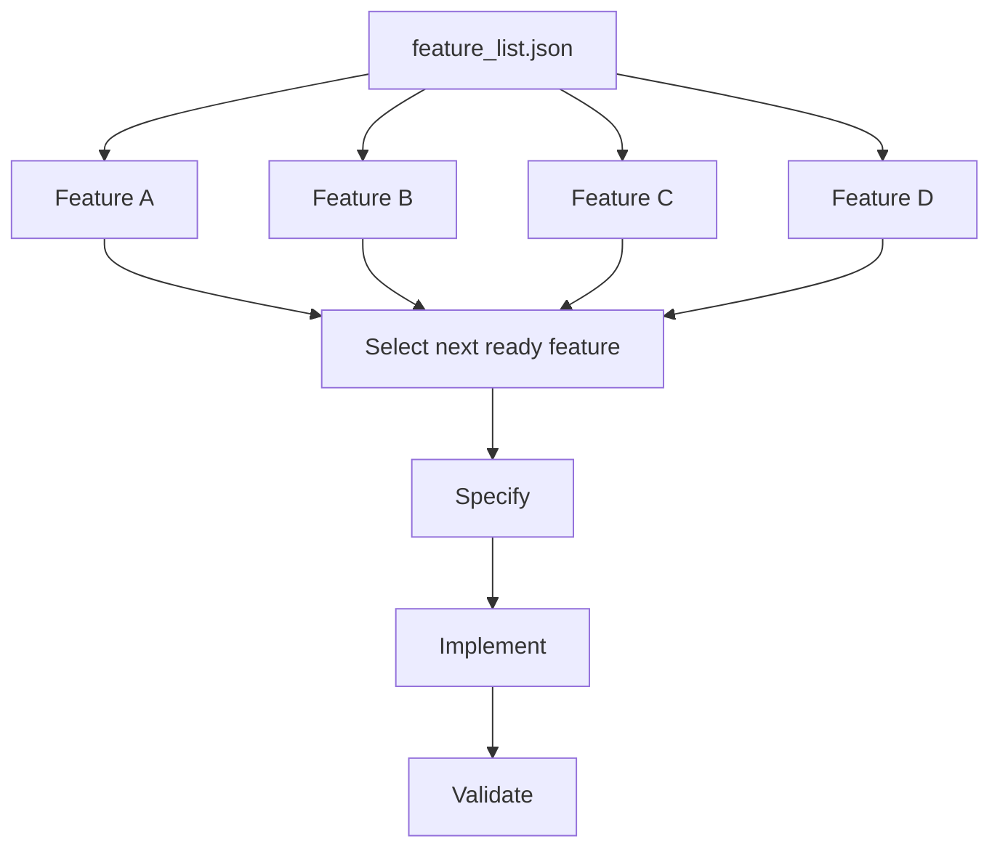

This makes the workflow particularly useful when the project contains multiple features that need to be developed progressively.

---

# 5. AI Expert Is Not a Waterfall Workflow

The AI Expert Workflow may look sequential because it separates:

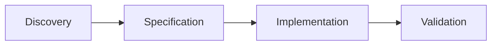

However, this sequence applies to the **current feature lifecycle**, not to the entire project.

The workflow is intended to proceed iteratively:

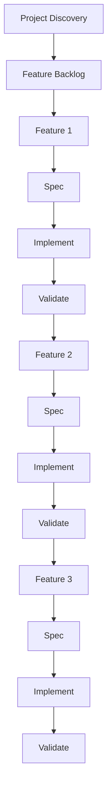

The project does not need to know every requirement, use case, or corner case before development begins.

Detailed specification happens close to implementation, one feature at a time.

This allows the project to learn from previous features and refine later requirements as the product evolves.

> **AI Expert is a structured iterative workflow, not a requirement-freeze-first waterfall process.**

---

# 6. Agent Responsibility

## Foundation Workflow

The same AI agent can perform the main responsibilities:

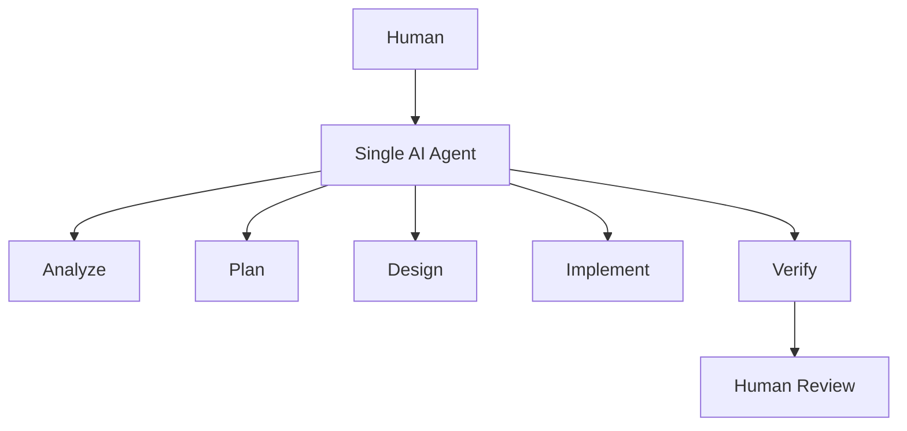

The main benefit is continuity.

The same agent retains the context of the feature and its architectural decisions throughout the workflow.

## AI Expert Workflow

Responsibilities are deliberately separated:

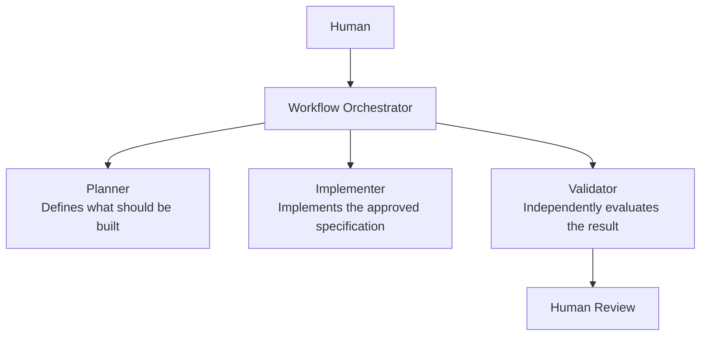

The validator is deliberately separated from the implementation role.

The objective is not simply to use more agents, but to create **different perspectives and explicit boundaries of responsibility**.

---

# 7. The Role of the Human

Both workflows are **human-supervised**.

The human remains the highest-level orchestrator and is responsible for:

* architecture,
* technical decisions,
* scope,
* approvals,
* review,
* and final acceptance.

The difference is what happens between the human and the result.

### Foundation

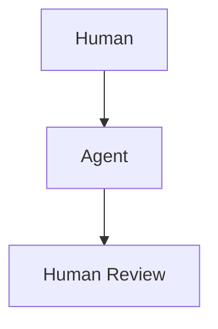

### AI Expert

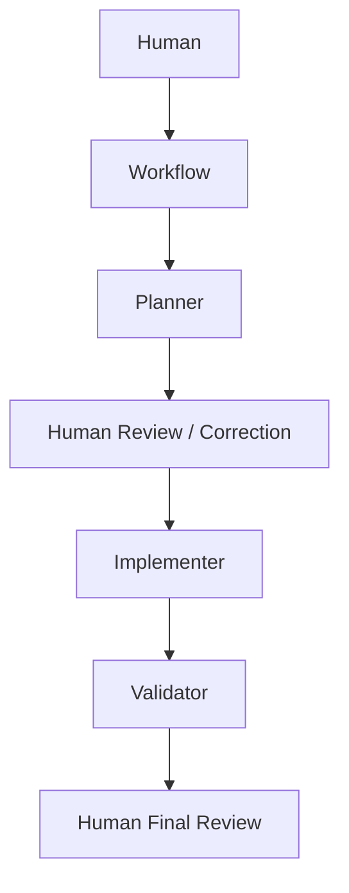

The human can intervene at any stage.

Therefore, the distinction is not:

> autonomous AI vs. human development

It is:

> **single-agent execution vs. multi-agent specialization under human supervision.**

---

# 8. Advantages and Trade-offs

| Aspect                          | Foundation Workflow  | AI Expert Workflow           |
| ------------------------------- | -------------------- | ---------------------------- |
| Primary unit of work            | Feature              | Project + feature            |
| Agent model                     | Single agent         | Multiple specialized agents  |
| Context continuity              | Very high            | Distributed across handoffs  |
| Project-level state             | Limited              | Explicit                     |
| Feature backlog                 | Optional / external  | Explicit                     |
| Feature dependencies            | Primarily contextual | Explicitly tracked           |
| Specification                   | Technical workflow   | Formal feature specification |
| Implementation role             | Same agent           | Dedicated implementer        |
| Validation                      | Integrated           | Independent validator        |
| Handoffs                        | Minimal              | Explicit                     |
| Coordination overhead           | Low                  | Higher                       |
| Computational cost              | Lower                | Higher                       |
| Process complexity              | Lower                | Higher                       |
| Traceability                    | Feature-level        | Lifecycle-level              |
| Independent perspectives        | Limited              | Stronger                     |
| Repetition across many features | Less structured      | Highly structured            |

---

# 9. Foundation Workflow — Strengths

## Continuity of Context

The same agent maintains the complete reasoning context:

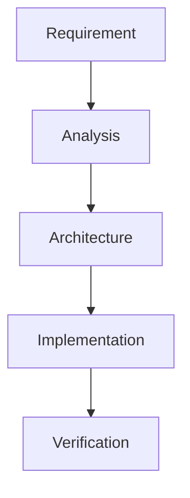

There is no need to transform every transition into a formal handoff.

## Simplicity

The workflow contains fewer moving parts.

There is no need to coordinate separate planner, implementer, and validator roles.

## Lower Overhead

A single-agent workflow generally requires:

* fewer agent executions,
* fewer handoffs,
* fewer intermediate artifacts,
* less coordination,
* and usually lower computational cost.

## Centralized Architectural Responsibility

One agent maintains a consistent view of the whole feature and its architectural implications.

This is useful when the design decisions are tightly connected.

---

# 10. Foundation Workflow — Trade-offs

## Limited Separation of Responsibilities

The same agent may:

1. design the solution,
2. implement it,
3. and evaluate its own result.

This provides continuity but reduces independence between these activities.

## Less Independent Validation

A single agent may be less likely to question assumptions it introduced earlier in the same workflow.

This does not mean validation is absent. It means validation is not performed by a separate role with a different context.

## Less Project-Level Workflow State

The Foundation Workflow focuses on the current feature rather than maintaining a formal queue of many features.

Projects that need extensive backlog management may benefit from a more structured workflow.

---

# 11. AI Expert Workflow — Strengths

## Separation of Responsibilities

The workflow creates explicit boundaries:

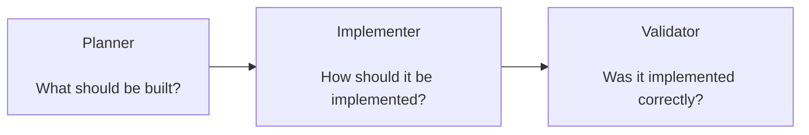

## Independent Validation

The validator provides a second perspective and can identify:

* missing requirements,
* incomplete implementation,
* deviations from the specification,
* architectural problems,
* missing evidence,
* and validation gaps.

## Persistent Project Context

Discovery and harness setup produce durable project context that can be reused across multiple features.

## Explicit Feature Lifecycle

Features have explicit states, dependencies, specifications, progress, and validation evidence.

This provides stronger traceability across a project with many features.

## Suitable for Agentic Development Experiments

The workflow makes the collaboration between specialized AI agents explicit and observable.

This is particularly useful when the development process itself is part of the objective.

---

# 12. AI Expert Workflow — Trade-offs

## More Complexity

The workflow itself becomes a system that must be maintained.

There are more moving parts:

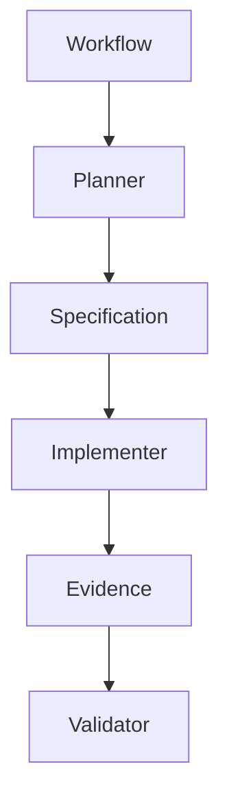

## More Handoffs

Context must be transferred correctly between stages.

Poorly defined specifications or incomplete evidence can create misunderstandings between agents.

## Higher Overhead

A feature may require several agent executions instead of one.

This can mean:

* more tokens,
* more execution time,
* more intermediate artifacts,
* and more coordination.

## Potential for Inconsistency

The planner, implementer, and validator may interpret an evolving requirement differently.

The workflow therefore depends heavily on the quality of:

* specifications,
* progress tracking,
* evidence,
* and handoff contracts.

---

# 13. When to Use the Foundation Workflow

Use the Foundation Workflow when:

* One agent can effectively own the feature from analysis through implementation.
* The project context is already reasonably understood.
* The feature can be handled as a continuous workflow.
* The architecture and constraints are known well enough to make repository-aware decisions.
* Minimizing coordination overhead is valuable.
* The human prefers to supervise one main AI execution flow.

Typical example:

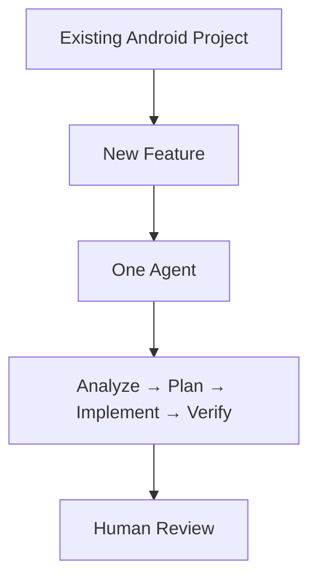

The Foundation Workflow is not limited to small features. A complete or substantial feature can also be handled this way when the single-agent model remains effective.

---

# 14. When to Use the AI Expert Workflow

Use the AI Expert Workflow when:

* The project benefits from explicit project discovery and persistent context.
* The development process benefits from a structured feature backlog.
* Features have meaningful dependencies or acceptance criteria.
* Planning, implementation, and validation benefit from separate responsibilities.
* Independent validation is valuable.
* Explicit specifications and handoffs are useful.
* Several specialized agents can provide meaningful value over a single continuous agent.
* The AI development process itself is part of the objective.

Typical example:

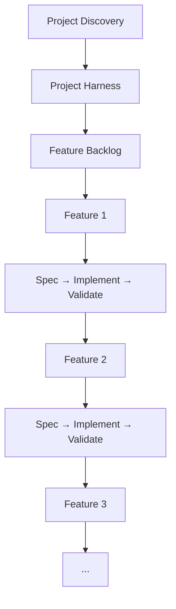

---

# 15. New vs. Existing Projects

Project age is a secondary consideration.

Both workflows can be used in new or existing projects.

### New Project

A new project may benefit from AI Expert when there is uncertainty around:

* product scope,
* domain,
* requirements,
* project structure,
* feature boundaries,
* or the development process itself.

However, a new project can use Foundation when the technical direction and feature scope are already clear.

### Existing Project

An existing project may benefit from Foundation when a feature can be handled efficiently within the established architecture.

However, an existing project can use AI Expert when a feature or group of features benefits from explicit specification, specialization, and independent validation.

Therefore:

> **Project maturity does not determine the workflow. The desired development model does.**

---

# 16. The Workflow Can Change Over Time

The selected workflow does not need to remain the same for the entire lifetime of a project.

For example:

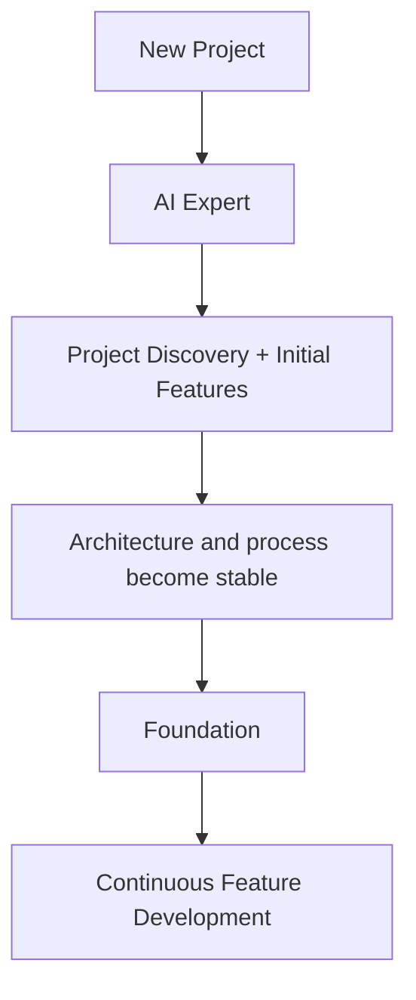

A project could also move in the opposite direction when a feature or development phase benefits from stronger separation of responsibilities:

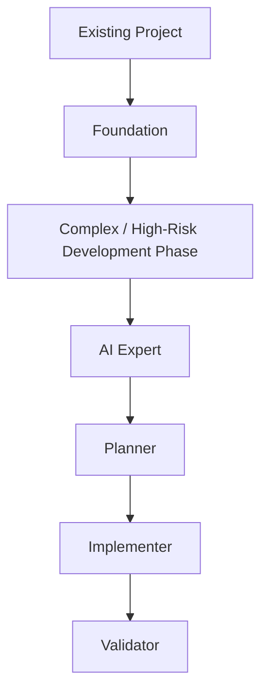

The important point is that a workflow change should represent a **deliberate change in development strategy**, not an ad-hoc switch for every feature.

The active workflow is selected through:

```text
.agents/workflow.json
```

and only one workflow should orchestrate feature development at a time.

---

# 17. A Practical Decision Rule

A simple decision rule is:

> **Use the Foundation Workflow when one agent can efficiently own the task end to end.**

> **Use the AI Expert Workflow when the project or task benefits from persistent project structure and separating planning, implementation, and validation across specialized agents.**

This is not a ranking.

It is a choice between two different execution models.

---

# 18. Example: BasketCoach

BasketCoach is a good example of how both workflows can be used at different stages.

### Initial project definition

The project starts with uncertainty around:

* the problem to solve,
* users,
* domain concepts,
* available data,
* MVP scope,
* and feature boundaries.

The AI Expert Workflow is a natural fit for this stage:

```mermaid
flowchart TD
    BB["build-brief"] --> HS["harness-starter"]
    HS --> FL["feature_list.json"]
```

### Iterative feature development

The project does not need to specify every future feature in complete detail before implementation begins.

Instead:

```mermaid
flowchart TD
    F1["Feature 1"]
    F1 --> S1["Specify"]
    S1 --> I1["Implement"]
    I1 --> V1["Validate"]
    V1 --> L["Learn"]

    L --> F2["Feature 2"]
    F2 --> S2["Specify"]
    S2 --> I2["Implement"]
    I2 --> V2["Validate"]
```

The knowledge gained from one feature can inform the next.

### Later project phase

If the project reaches a point where:

* the architecture is stable,
* the feature patterns are well understood,
* the backlog is relatively predictable,
* and multi-agent coordination creates more overhead than value,

the project may switch to the Foundation Workflow for subsequent development.

```mermaid
flowchart TD
    AE["AI Expert"]
    AE --> L["Learn the process"]
    L --> FW["Foundation"]
    FW --> E["Efficient single-agent feature execution"]
```

The reverse transition is also possible when a later phase benefits from specialized agents and independent validation.

---

# 19. Final Comparison

```mermaid
flowchart TB
    FW["FOUNDATION WORKFLOW<br/><br/>Feature-centric<br/>Single agent<br/>Continuous context<br/>Centralized responsibility<br/>Low coordination overhead<br/>Persistent feature roadmap"]

    AE["AI EXPERT WORKFLOW<br/><br/>Project-centric<br/>Multi-agent<br/>Explicit specifications<br/>Persistent feature lifecycle<br/>Explicit handoffs<br/>Independent validation"]

    CORE["SHARED FOUNDATION<br/><br/>Same engineering standards"]

    FW --> CORE
    AE --> CORE
```

Both operate under the same Foundation and remain human-supervised.

The choice is therefore not about which workflow is universally better.

It is about **which organization of AI work best fits the current development phase and the nature of the task**.

> **Same Foundation, different development methodology.**
